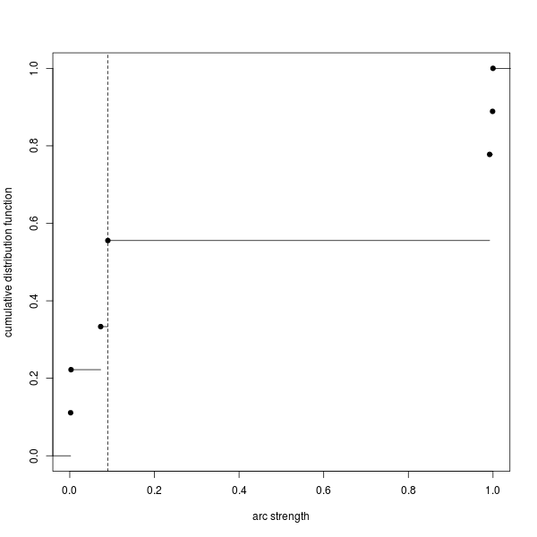

.. _average-network: 

Average network
===============

The primary usage of BayesNetty is to calculate an average network as described in this section.
An average network can be calculated using the methods described by :cite:`bnlearn_paper`.
In brief, a bootstrap sample (with replacement) of the data is taken and a network search is used to find a best fit network.
The process is repeated *k* times and the resulting *k* networks are averaged to give a final average network,
in which the edge strengths represent the proportion of replicates in which that edge appeared.  

.. _average-network-options:

Options
-------

The options are as follows:

.. list-table:: 
    :header-rows: 1

    * - Option
      - Description
      - Default

    * - -average-networks
      - do a task to calcualte an average network
      - 

    * - -average-networks-name name
      - label the task with a name
      - Task-n

    * - -average-networks-network-name network
      - the name of the network for which the average network is calculated
      - previous network (or the default model given by a node for each data variable and no edges if there is no previous network)  

    * - -average-networks-file average-network.dat
      - the name of the output file to record the average network in
      - 

    * - -average-networks-igraph-file-prefix mygraph
      - output igraph format files consisting of mygraph-nodes.dat, mygraph-edges.dat and R code mygraph-plot.R
      - 

    * - -average-networks-threshold thres
      - the strength threshold used to include an edge in the average network plotted using the igraph files
      - estimated

    * - -average-networks-bootstraps k
      - the number of bootstraps used to calculate the average network
      - 100

    * - -average-networks-random-restarts n
      - for each network fit do another n searches starting from a random network
      - 0

    * - -average-networks-jitter-restarts m
      - for each network fit after the initial search and every random restart search do another m searches jittered from the recently found network
      - 0

    * - -average-networks-use-weight-method
      - use edge chi square significance values to weight the edge strengths
      - 

    * - -average-networks-use-score-method
      - use network score method instead of bootstrapping (slow)
      - 

    * - -average-networks-likelihood-file
      - output likelihoods of separate bootstrap networks to file
      - 

 

.. _average-network-score: 

Score Method
------------

An alternative method for computing the average network instead of bootstrapping the data is available using
the `-average-networks-use-score-method` option. This method requires calculating the likelihoods of every possible network and is therefore more accurate but takes much more time to compute.
For large networks this can normally be unfeasible to calculate within acceptable time limits.
Investigations comparing the two approaches for small networks found no major differences between the two approaches.

.. _average-network-example:

Example
-------

An example of calculating an average network is contained in the parameter file `paras-average.txt`,
which can be found in `example.zip <https://github.com/NewcastleRSE/BayesNetty/raw/refs/heads/main/docs/resources/example.zip>`_. 

.. code-block:: none

    #input continuous data
    -input-data
    -input-data-file example-cts.dat
    -input-data-cts

    #input discrete data
    -input-data
    -input-data-file example-discrete.dat
    -input-data-discrete

    #input SNP data as discrete data
    -input-data
    -input-data-file example.bed
    -input-data-discrete-snp

    #calculate average network
    -average-networks
    -average-networks-file average-network-example.dat
    -average-networks-igraph-file-prefix ave-graph-example
    -average-networks-bootstraps 1000

This can be executed as usual

.. code-block:: none

    ./bayesnetty paras-average.txt

and will output something as follows

.. code-block:: none

    BayesNetty: Bayesian Network software, v1.00
    --------------------------------------------------
    Copyright 2015-present Richard Howey, GNU General Public License, v3
    Institute of Genetic Medicine, Newcastle University

    Random seed: 1551700618
    --------------------------------------------------
    Task name: Task-1
    Loading data
    Continuous data file: example-cts.dat
    Number of ID columns: 2
    Including (all) 2 variables in analysis
    Each variable has 1500 data entries
    Missing value: not set
    --------------------------------------------------
    --------------------------------------------------
    Task name: Task-2
    Loading data
    Discrete data file: example-discrete.dat
    Number of ID columns: 2
    Including the 1 and only variable in analysis
    Each variable has 1500 data entries
    Missing value: NA
    --------------------------------------------------
    --------------------------------------------------
    Task name: Task-3
    Loading data
    SNP binary data file: example.bed
    SNP data treated as discrete data
    Total number of SNPs: 2
    Total number of subjects: 1500
    Number of ID columns: 2
    Including (all) 2 variables in analysis
    Each variable has 1500 data entries
    --------------------------------------------------
    --------------------------------------------------
    Task name: Task-4
    Calculating average network using bootstrapping
    --------------------------------------------------
    Loading defaultNetwork network
    Network type: bnlearn
    Network score type: BIC
    Total number of nodes: 5 (Discrete: 3 | Factor: 0 | Continuous: 2)
    Total number of edges: 0
    Network Structure: [express][pheno][mood][rs1][rs2]
    Total data at each node: 1495
    Missing data at each node: 5
    --------------------------------------------------
    Network: defaultNetwork
    Number of bootstrap iterations: 1000
    Random restarts: 0
    Random jitter restarts: 0
    Average network output to file: average-network-example.dat
    R code to plot average network: ave-graph-example.R
    Estimated edge threshold: 0.09
    Network structure (after above threshold): [mood][rs1][rs2][express|rs1:rs2][pheno|express:mood]
    Network score type: BIC
    Network score = -8213.45
    --------------------------------------------------

    Run time: 1 minute and 10 seconds

The above shows the data input and then the default network input consisting of a node for each data variable given by the data and no edges.
The average network is written to the file `average-network-example.dat` and will look something like:

.. code-block:: none

    from    type1   to      type2   strength        direction
    express c       pheno   c       1       0.949
    rs1     d       express c       0.999   1
    mood    d       pheno   c       0.992   1
    rs2     d       express c       0.992   1
    rs2     d       pheno   c       0.09    1
    rs1     d       pheno   c       0.09    1
    mood    d       express c       0.073   1
    rs2     d       mood    d       0.003   1
    rs1     d       mood    d       0.002   1

The option to output R code and data to plot the average network, `-average-networks-igraph-file-prefix`, was also used. This is similar to the method used to draw a regular network, see :ref:`plot-network`.

The R file, `ave-graph-example.R`, will look something as follows:

.. code-block:: none

    #threshold, an arc must be greater than the threshold to be plotted
    threshold<-0.09
    plotThresholdEst<-TRUE

    #load igraph library, http://igraph.org/r/
    library(igraph)

    #load average network graph
    aveGraph<-read.table("average-network-example.dat", header=TRUE, stringsAsFactors=FALSE)

    #plot arc strength versus cumulative number of arcs with strength <= arc strength
    if(plotThresholdEst) {
    png(filename="ave-graph-example-thresholdEst.png", width=600, height=600)
    y<-c()
    for(stren in aveGraph$strength) y<-append(y, sum(aveGraph$strength <= stren))
    plot.stepfun(aveGraph$strength, xlab="arc strength", ylab="cumulative distribution function", verticals=FALSE, xlim=c(0,1), pch=19, main="")
    abline(v=threshold, lty=2)
    dev.off()
    }

    #create node and edge tables for igraph
    #map node names to numbers
    nodeList<-as.numeric(as.factor(c(aveGraph$from, aveGraph$to)))
    noArcs<-length(aveGraph$from)
    fromNum<-nodeList[1:noArcs]
    toNum<-nodeList[(noArcs+1):(2*noArcs)]
    nodes1<-as.data.frame(cbind(fromNum, aveGraph$from, aveGraph$type1))
    colnames(nodes1)<-c("id", "name", "type")
    nodes2<-as.data.frame(cbind(toNum, aveGraph$to, aveGraph$type2))
    colnames(nodes2)<-c("id", "name", "type")
    nodes<-unique(rbind(nodes1, nodes2))
    edges<-as.data.frame(cbind(fromNum, toNum, aveGraph$strength, aveGraph$direction))
    colnames(edges)<-c("from", "to", "strength", "direction")

    #apply threshold for plotting arc/edge
    edges<-edges[edges$strength > threshold,]

    #create graph
    graph<-graph_from_data_frame(edges, directed = TRUE, vertices = nodes)

    #plot the network and output png file, edit style as required

    #style for continuous nodes
    shape<-rep("circle", length(nodes$type))
    vcolor<-rep("#eeeeee", length(nodes$type))
    vsize<-rep(25, length(nodes$type))
    color<-rep("black", length(nodes$type))

    #style for discrete nodes
    shape[nodes$type=="d"]<-"rectangle"
    vcolor[nodes$type=="d"]<-"#111111"
    vsize[nodes$type=="d"]<-20
    color[nodes$type=="d"]<-"white"

    #style for factor nodes
    shape[nodes$type=="f"]<-"rectangle"
    vcolor[nodes$type=="f"]<-"#eeeeee"
    vsize[nodes$type=="f"]<-20
    color[nodes$type=="f"]<-"black"

    #edge widths for significances
    minWidth<-0.3
    maxWidth<-10
    edgeMax<-max(edges$strength)
    edgeMin<-min(edges$strength)
    widths<-((edges$strength-edgeMin)/(edgeMax-edgeMin))*(maxWidth - minWidth) + minWidth
    styles<-rep(1, length(widths))

    #plot to a png file
    png(filename="ave-graph-example.png", width=800, height=800)

    plot(graph, vertex.shape=shape, vertex.size=vsize, vertex.color=vcolor, vertex.label.color=color, edge.width=widths, edge.lty=styles,
    edge.color="black", edge.arrow.size=1.5, edge.label = signif(edges$direction,3), edge.label.cex=1.5, edge.label.color="red")

    #finish png file
    dev.off()

This R file can be ran as follows in Linux

.. code-block:: none

    R --vanilla < ave-graph-example.R

and produces the `.png` image file of the average network.

.. _plot-ave1-fig:

.. figure:: images/ave-graph-example.png
   :class: custom-figure

   Plot of the average network drawn using the igraph R package.

The edges are drawn proportional to the edge strength (but scaled to be between the minimum and maximum edge widths),
that is, the proportion of best fit networks that the edge appears in after bootstrapping. Although using the `-average-networks-use-weight-method` option the strength
can be weighted using the chi square values of each edge significance. The direction indicates the proportion of times the edge points in the given direction when it appears in a best fit network.
The edges are labelled in red with the strength values followed by the direction values in brackets.
Edges between discrete and continuous nodes do not have a direction value as they are constrained to be from the discrete node to the continuus node.
The plot can easily be updated to your needs by following the `igraph <https://www.staff.ncl.ac.uk/richard.howey/bayesnetty/>`__ R package documentation. 

A graph may also be output to show the cumulative number of edges in the average network for different strength thresholds.
If an edge has a strength greater than the strength threshold then it is included in the average network. 

.. _plot-ave2-fig:

   Plot of the cumulative number of edges in the average network for different strength thresholds.

.. _average-network-parallel:

Parallel Example
----------------

As calculating the average network is a computationally intensive task, it makes sense it calculate it in parallel.
This can be done by running the parallel version of BayesNetty as described in :ref:`parallel`,
but a much quicker way is given here by running the non-parallel version of BayesNetty in parallel and then combining the individual average network results in one final average network.

The handy Unix script `runCalcAveNetPara` can be ran to do this as follows:

.. code-block:: none

    ./runCalcAveNetPara paras-average-parallel.txt average-network-example 20

Where the first argument is a BayesNetty parameter file to calculate an average network, as below for example.
The second argument is the file name of the average network to output, and the last argument is the number of processes to run in parallel.
This will run 50 times 20 bootstraps (equal to 1000 bootstraps) overall to calculate the average network. 

.. code-block:: none

    #input continuous data
    -input-data
    -input-data-file example-cts.dat
    -input-data-cts

    #input discrete data
    -input-data
    -input-data-file example-discrete.dat
    -input-data-discrete

    #input SNP data as discrete data
    -input-data
    -input-data-file example.bed
    -input-data-discrete-snp

    #calculate average network
    -average-networks
    -average-networks-bootstraps 50

The linux script `runCalcAveNetPara`, as shown below, runs a number of BayesNetty processes in parallel and sets different output files.
As the random number seed is set by default by the execution time, and the processes are set off at the same time, it is necessary to set the seed to different values.
The individual average networks are then combined using the `collate-average-nets.R` R script.
Also, R code to plot the average graph is also output, which is modified for the appropriate threshold to plot the edges and the final average network file name.  

.. code-block:: none

    #!/bin/bash                                                                                                                                          

    # $1 = parameter file to calculate average network in parallel                                                                                       
    # $2 = average network file name                                                                                                                     
    # $3 = no. of processes to run in parallel                                                                                                           

    RANDOM=$$
    #run bayesnetty $3 times for X bootstraps each                                                                                                       
    #all processes are ran simultaneously in the background
    for i in $(seq 1 $3);
    do

    ./bayesnetty $1 -so -seed $i0$RANDOM -average-networks-file $2$i-i.dat -average-networks-igraph-file-prefix $2-graph&

    done

    #wait for all processes to finish                                                                                                                    
    wait

    #collate the results into a final average file                                                                                                       
    R --vanilla --args $2 $3 < collate-average-nets.R

    #delete individual average network files                                                                                                             
    rm $2*-i.dat

    #plot the final network                                                                                                                              
    #set threshold                                                                                                                                       
    t=$(cat "$2-threshold.dat")
    sed -i "s/threshold<-/threshold<-$t #/g" $2-graph.R

    #set final average file name                                                                                                                         
    sed -i "s/aveGraph<-/aveGraph<-read.table(\"$2.dat\", header=TRUE, stringsAsFactors=FALSE) #/g" $2-graph.R

    #plot average network                                                                                                                                
    R --vanilla < $2-graph.R

The R script `collate-average-nets.R` (used in the linux script above) combines the average networks and calculates a suggested threshold for plotting the network, as given below:

.. code-block:: none

    #R file to collate average networks ran in parallel - all average networks must have been calculated with the same number of bootstraps
    cmd_args<-commandArgs()

    fileName<-cmd_args[4]
    noFiles<-as.numeric(cmd_args[5])

    totalNet<-read.table(paste(fileName,1,"-i.dat",sep=""), header=TRUE, stringsAsFactors=FALSE)

    totalNet<-cbind(totalNet, rep(1, length(totalNet[,1])))
    colnames(totalNet)[7]<-"count"

    for(i in 2:noFiles)
    {
      aveNet<-read.table(paste(fileName,i,"-i.dat",sep=""), header=TRUE, stringsAsFactors=FALSE)
      aveNet<-cbind(aveNet, rep(1, length(aveNet[,1])))
      colnames(aveNet)[7]<-"count"
      
      ##loop thro' rows of average table
      for(j in 1:length(aveNet[,1]))
      {
        ##find edge in total
        totRow<-which(aveNet$from[j]==totalNet$from & aveNet$to[j]==totalNet$to)
        if(length(totRow) == 1)
        {
            totalNet$strength[totRow]<-totalNet$strength[totRow] + aveNet$strength[j]
            totalNet$direction[totRow]<-totalNet$direction[totRow] + aveNet$direction[j]
            totalNet[totRow,7]<-totalNet[totRow,7]+1
        } else {
            totRow<-which(aveNet$from[j]==totalNet$to & aveNet$to[j]==totalNet$from)
            if(length(totRow) == 1)
            {
              totalNet$strength[totRow]<-totalNet$strength[totRow] + aveNet$strength[j]
              totalNet$direction[totRow]<-totalNet$direction[totRow] + 1 - aveNet$direction[j]
              totalNet[totRow,7]<-totalNet[totRow,7]+1
            } else {     
              totalNet<-rbind(totalNet, aveNet[j,])            
            }     
        }     
      }
    }

    ##take average over all average networks
    totalNet$strength<-totalNet$strength/noFiles
    totalNet$direction<-totalNet$direction/totalNet[,7]

    totalNet<-totalNet[order(-totalNet$strength),1:6]

    #reorder edges if direction < 0.5
    for(j in 1:length(totalNet[,1]))
    {
      if(totalNet$direction[j] < 0.5)
      {
          totalNet[j,]<-c(totalNet$to[j], totalNet[j,2], totalNet$from[j], totalNet[j,4], totalNet[j,5], 1-as.numeric(totalNet[j,6]))
      }
    }

    write.table(totalNet, paste(fileName,".dat",sep=""), quote=FALSE, col.names=TRUE, row.names=FALSE)

    #calculate suggested threshold for plotting network
    cumCount = 0;
    arcStrength = 0;
    arcStrengths<-c()
    cumArcStrengths<-c()
    oas<-1
        
    repeat
    {
        arcStrength = rev(totalNet$strength)[oas];
        
        repeat
        {			
          oas<-oas+1
          cumCount<-cumCount+1

        if(rev(totalNet$strength)[oas] > arcStrength || oas > length(rev(totalNet$strength))) break
        }
        
        if(length(arcStrengths) > 0 && arcStrength == arcStrengths[length(arcStrengths)])
        {
          arcStrengths[length(arcStrengths)]<-arcStrength
          cumArcStrengths[length(arcStrengths)]<-cumCount
        } else {
          arcStrengths<-append(arcStrengths, arcStrength)
          cumArcStrengths<-append(cumArcStrengths, cumCount)
        } 
        
        if(oas > length(rev(totalNet$strength))) break
    }
    
    bestL1score<-cumCount
    propArcs<-cumArcStrengths/cumArcStrengths[length(cumArcStrengths)]

    for(i in 1:length(arcStrengths)) #casTh in acumTot) 
    {
        j<-1
        L1score = propArcs[i] * arcStrengths[1];
      
        prevCum = propArcs[j];
        prevStrength = arcStrengths[j];
        j<-j+1;

        while(j <= length(arcStrengths)) 
        {
          if(prevCum > propArcs[i]) L1score<-L1score + (prevCum - propArcs[i]) * (arcStrengths[j] - prevStrength)
          else L1score<-L1score + (propArcs[i] - prevCum) * (arcStrengths[j] - prevStrength)
          
          prevCum = propArcs[j];
          prevStrength = arcStrengths[j];
          j<-j+1
        }

        if(L1score < bestL1score)
        {
          bestL1score = L1score;
          bestThreshold = arcStrengths[i]
        }
    }
    
    write.table(bestThreshold, paste(fileName,"-threshold.dat",sep=""), quote=FALSE, col.names=FALSE, row.names=FALSE)

The files `paras-average-parallel.txt`, `runCalcAveNetPara` and `collate-average-nets.R` can be found in the `example.zip <https://github.com/NewcastleRSE/BayesNetty/raw/refs/heads/main/docs/resources/example.zip>`_ file.
